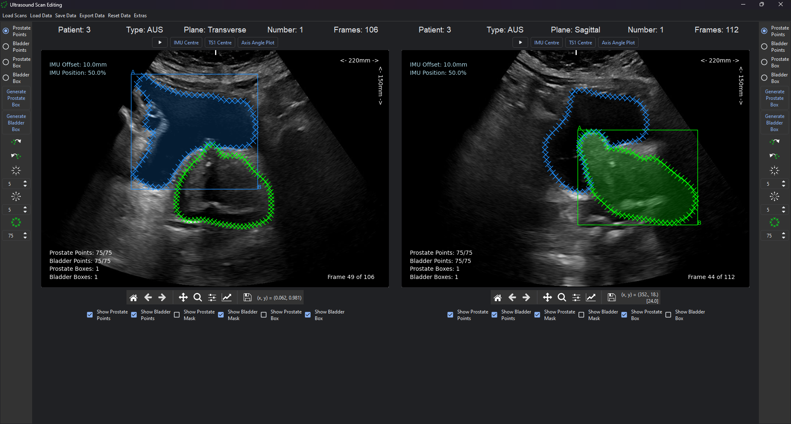

# Ultrasound Annotation Package

A custom-built application for annotating abdominal ultrasound scans of the prostate. This application
was developed as part of me PhD project. Why not just use an already available annotation software?
Good question! Unfortunately there is a poor excuse of an answer: I was concerned about 
patient data privacy. The university made such a stink about data privacy that I thought it
best that no one else "saw" my patient data. This was a mistake, I should have just used
3D-Slicer or something similar. This application was not an entire waste of time, much was learnt on 
the way, and overall it functions fairly well. Some key learnings that took place:
1. Dealing with memory leaks, e.g.: Scrolling through frames resulted in a memory leak, but all that
was needed was to clear the axis before plotting the next frame. Crazy.
2. Multiprocessing: Although after one of the updates multiprocessing was not strictly necessary,
it was fun learning how to use queues to send data between processes.
3. Online inference: One of the versions made use of online inference, where an image was sent to
a server I had set up for inference to take place. The result was then returned to this application
and displayed. No longer used, but still.
4. Many, MANY other things were learnt while creating this. Too many.

There have been a few major upgrades that have probably resulted in a bunch of the functions 
no longer working properly. As such, this repo serves purely as evidence that this application 
exists and should probably not be used by anyone :).

Having said that, this application was presented to multiple medical professionals throughout
the course of my studies so that they could annotate the data properly, and after v0.1 (where
the application kept crashing as it was hastily put together) there were no complaints. I feel 
pretty good about that.

## Look and Feel
The image below shows how the application looks while running. Many things going on. You can mark out 
the boundary of the prostate and the bladder, generate bounding boxes, scroll through frames, copy
points from an adjacent frame onto the current frame, save and load user data, export data in formats
that were ready for machine learning training, and other things.

## Current Status
There is not much development happening with this anymore as it has largely served its purpose.
There are still a few more annotation runs that need to be done, but those won't require updates.
Maybe the export functions will need to be updated at some point, but that is about it. I am pretty
sure a couple functions no longer work, but that's fine.